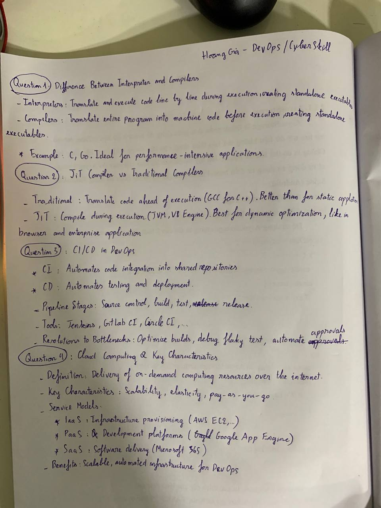
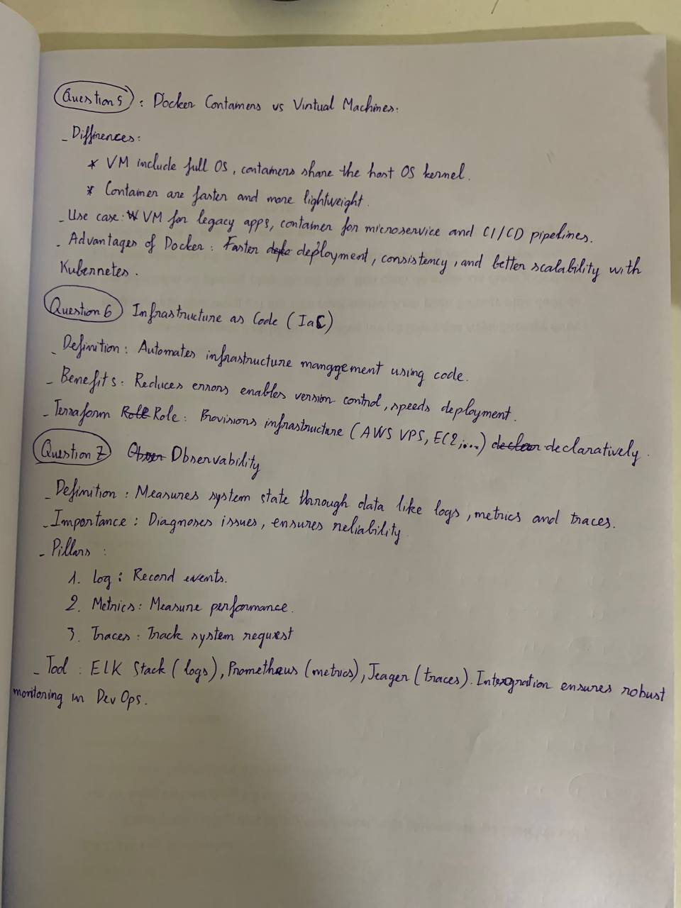
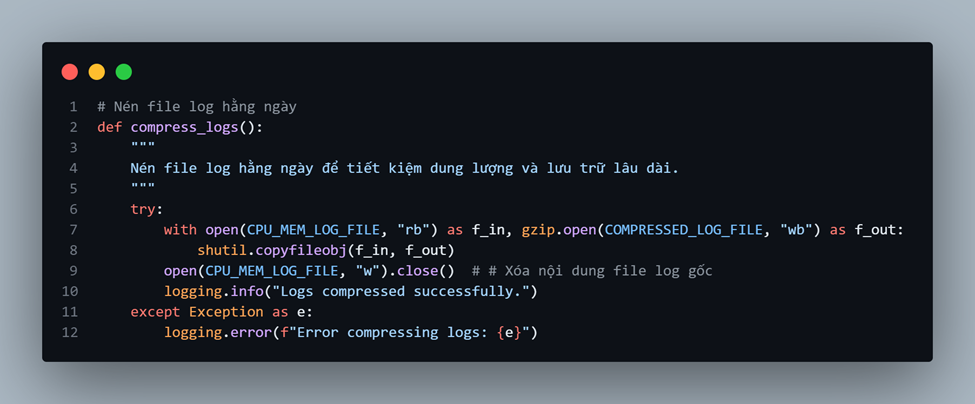
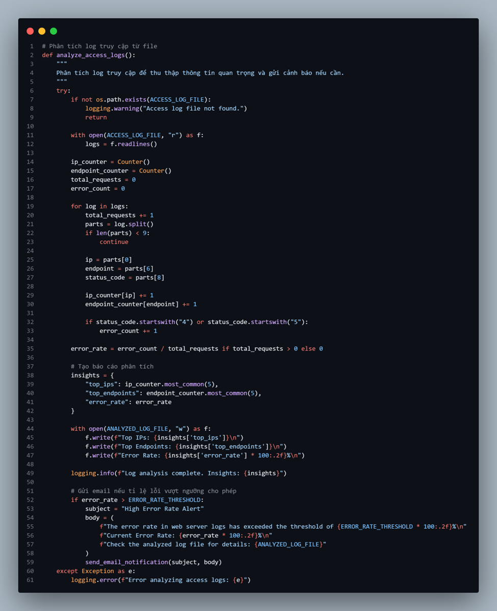
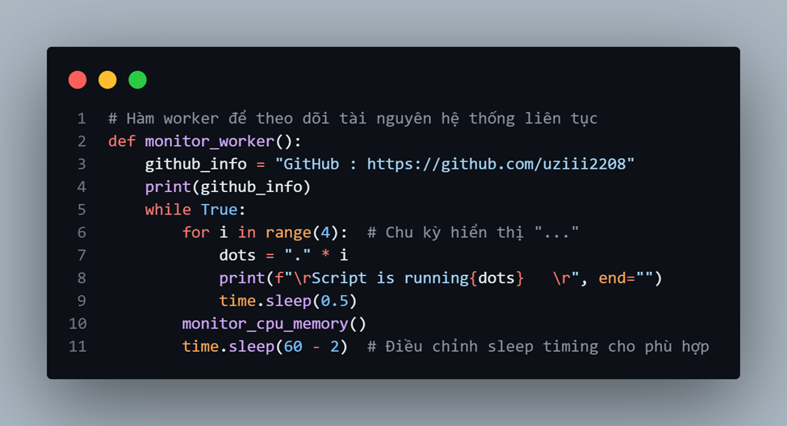
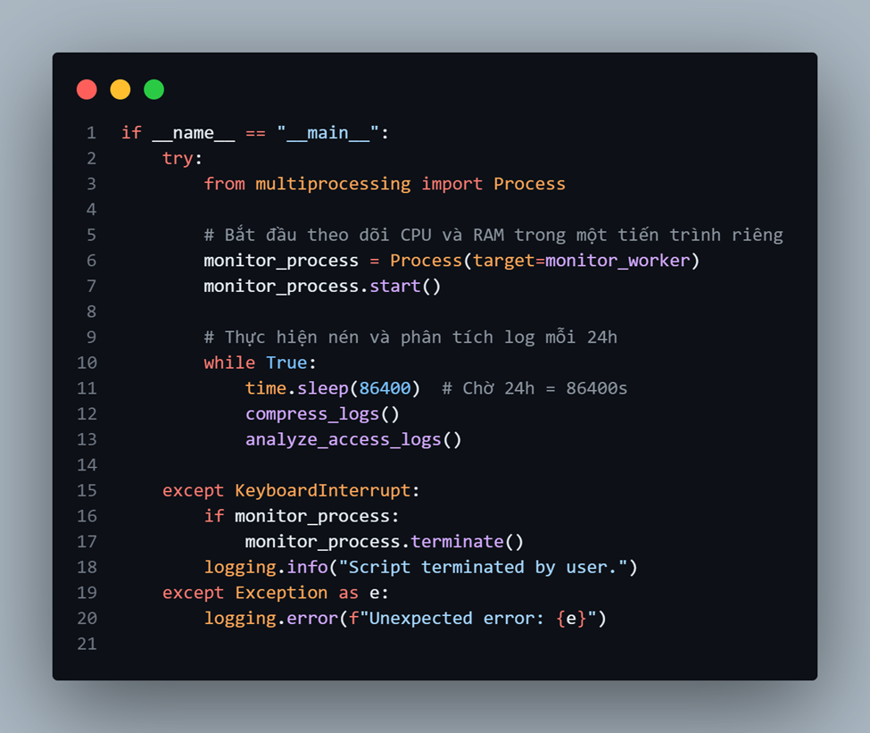
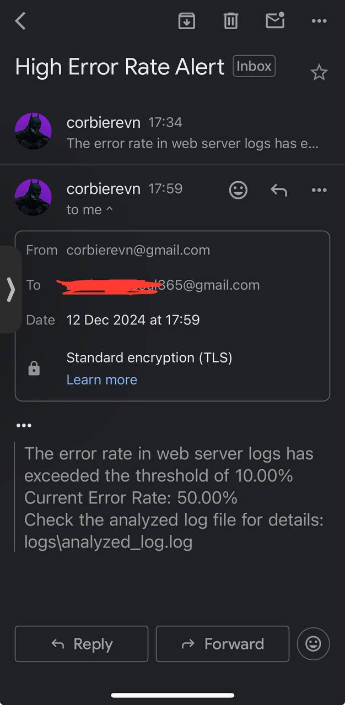

# Lab Final Assignment | CyberSkill
## Yêu cầu thực hiện 

---

### Part I: Theory (40%)
```
1. Explain the difference between interpreters and compilers. Provide examples of
programming languages that use interpreters and compilers. Discuss scenarios
where one is preferred over the other.
2. Differentiate between Just-in-Time (JIT) compilers and traditional compilers.
Provide examples of JIT implementations and their use cases.
3. Define CI/CD and its importance in DevOps. Explain the stages of a CI/CD
pipeline. List tools commonly used in CI/CD and compare their features. Discuss
common bottlenecks in CI/CD pipelines and strategies to resolve them.
4. Define cloud computing and its key characteristics (e.g., scalability, elasticity).
Compare IaaS, PaaS, and SaaS with examples. Discuss the benefits of using cloud
computing in DevOps.
5. Compare Docker containers and virtual machines in terms of architecture,
performance, and use cases. List the advantages of using Docker over virtual
machines in a DevOps workflow.
6. Define IaC and its benefits. Explain the role of Terraform in automating
infrastructure. Provide an example use case of Terraform in a DevOps project.
7. Define observability and its importance in a production environment. Explain the
three pillars of observability: logs, metrics, and traces. List tools commonly used
for observability and discuss how they integrate into the DevOps lifecycle
```





---

### Part II: Lab (60%)
```
1. Lab 1 (15%)
Write a Python or Bash script to:
•	Monitor CPU and memory usage of a system.
•	Log the information to a file every minute.
•	Compress the log file daily.
•	Parse and analyze access logs from a web server.
•	Generate insights such as the top 5 IP addresses by request count, most frequently accessed endpoints, and error rates.
•	Automate email notifications if error rates exceed a threshold.
•	Include proper error handling, logging, and parameterization in your script.
```

- Since this is a lab, we will script the monitoring tasks in the most basic and intuitive way on the local system. For optimizing monitoring for tasks and resources on the server, using IPS/IDS tools like Suricata or SIEM tools like Splunk and AlienVaults will be more stable in practice.


- Before running the script, make sure that your mail server account (in this case, Google) has an app password ready. If not, create an app password here: https://myaccount.google.com/apppasswords.


- Regarding the necessary libraries: I will be writing this script in Python. My .env file will not be pushed to Git due to some security concerns.


- Regarding the necessary configurations:
   - Load environment variables from the .env file.
   - Define directories and output log files.
   - Set an error threshold ratio to trigger email notifications.
   - Configure logging.


- About the email notification function :


- About the function monitoring CPU & RAM:


- About the function compressing log files daily:



- About the function analyzing access logs:



- About the ```worker``` function monitoring resources continuously and cyclically:



- Finally, regarding the main function of the script:



### Field test :


- First, the data from access.log will be extracted from the server to run a local field test.
- Next, when running the script ```helloworld.py```, you will see the logs starting to run gradually as follows:
   1. First, monitor CPU & memory — at the same time, ```script.log``` will display the timeline for each CPU & memory measurement.
   2. After 5 minutes, if there were errors previously, notifications will be sent to your email immediately (once every 5 minutes).
   3. After 24 hours, detailed logs in ```script.log``` will be packaged into ```daily.log.gz```.



```
2. Lab 2 (15%)
Create a CI/CD pipeline to deploy a Node.js application using GitHub Actions: https://github.com/arifsetiawan/node-test-sample. The pipeline should include:
•	Code linting and unit tests.
•	Building a Docker image of the application.
•	Deploying the Docker container to a local environment or cloud service.
•	Document the steps to set up and run the pipeline.
```

[Watch here](https://github.com/uziii2208/Docker_Assignment)

```
3. Lab 3 (15%)
Deploy an application using Docker and Docker Compose.
Use Docker Compose to set up the application and integrate Grafana for observability (https://github.com/arifsetiawan/node-test-sample):
•	Use Grafana Loki for logging.
•	Use Grafana Mimir for metrics.
•	Create dashboards to monitor logs and metrics.
•	Document how to access and use the Grafana dashboards.
```

[Watch here](https://github.com/uziii2208/Docker_Assignment_2)

```
4. Lab 4 (15%)
Use Terraform to:
•	Define infrastructure for a Dockerized application.
•	Create at least one container and expose it via a network port.
•	Provide a README.md explaining how to use your Terraform configuration to provision the infrastructure.
```

[Watch here](/Lab_Assignment_Final/terraform/README.md)

---
