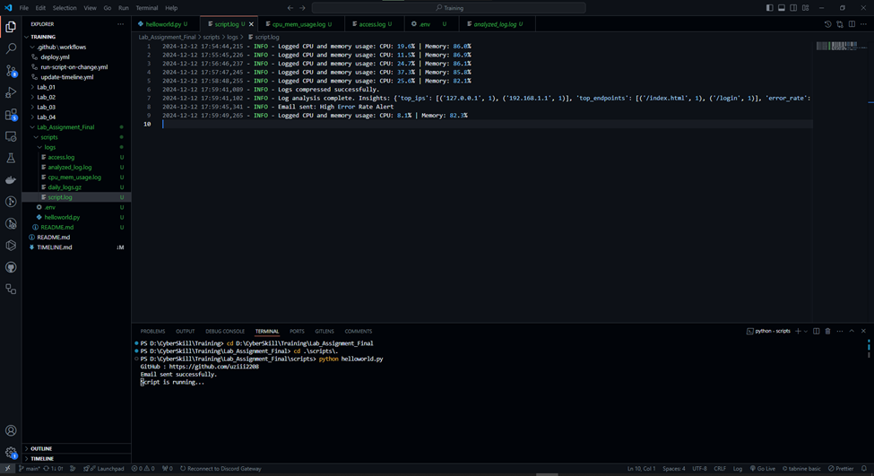
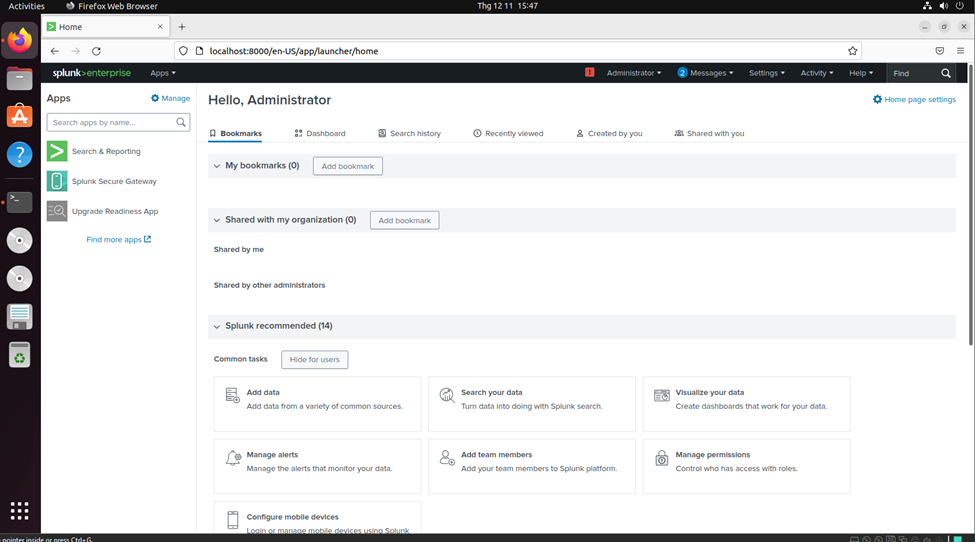
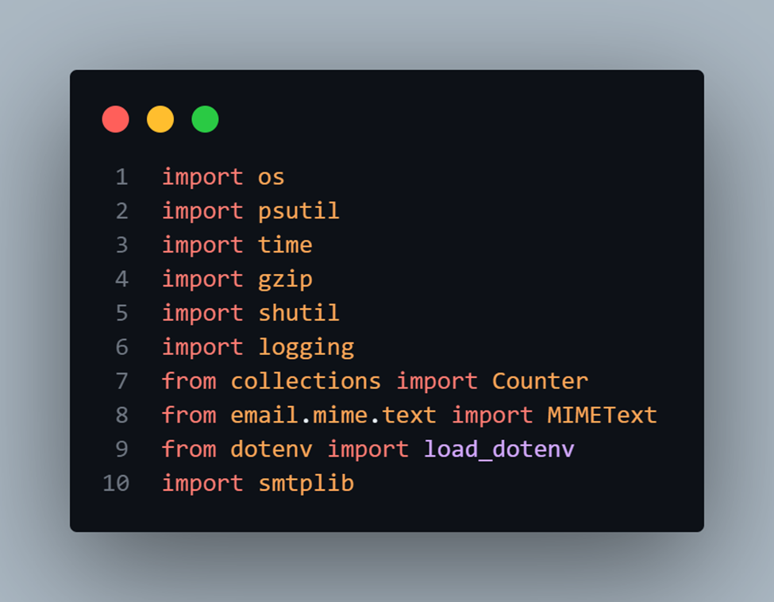
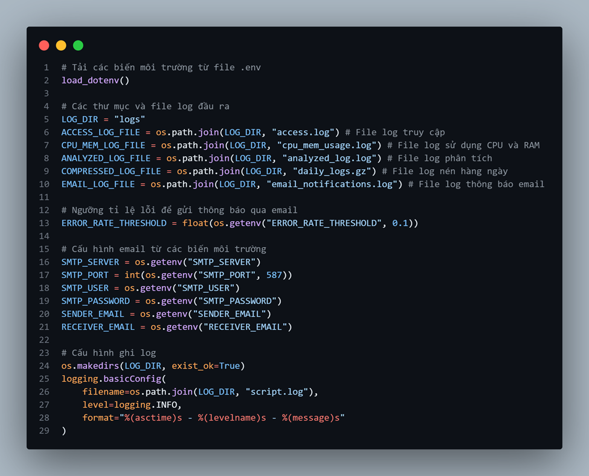
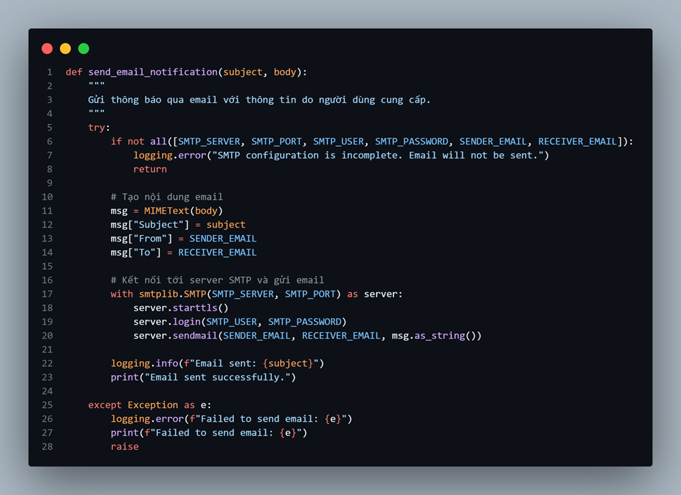
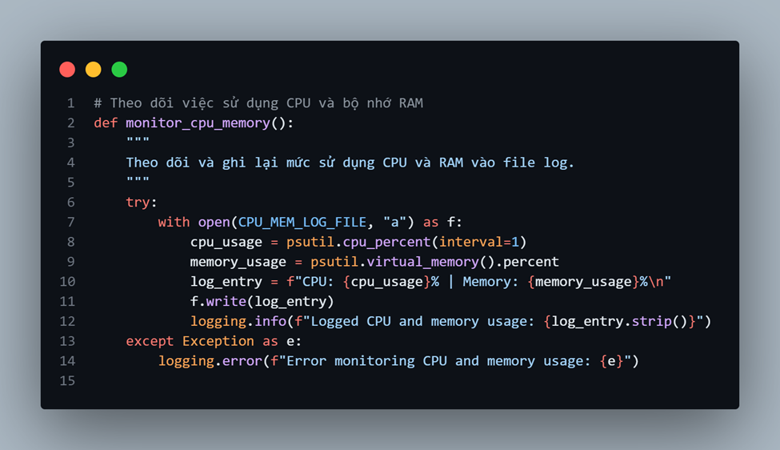

# Lab Final Assignment | CyberSkill
## Yêu cầu thực hiện 

---

Part I: Theory (40%)

---

Part II: Lab (60%)


```
1. Lab 1 (15%)
Write a Python or Bash script to:
•	Monitor CPU and memory usage of a system.
•	Log the information to a file every minute.
•	Compress the log file daily.
•	Parse and analyze access logs from a web server.
•	Generate insights such as the top 5 IP addresses by request count, most frequently accessed endpoints, and error rates.
•	Automate email notifications if error rates exceed a threshold.
•	Include proper error handling, logging, and parameterization in your script.
```



- Vì đây là một bài lab nên ta sẽ script cho việc monitoring theo yêu cầu 1 cách basic và trực quan nhất trên local. Việc tối ưu monitoring cho các tác vụ & tài nguyên trên server ta có thể sử dụng các loại IPS/IDS (Suricata), SIEM như Splunk, AlienVaults sẽ ổn định hơn trên thực tế.



- Trước khi để thực hiện script thì bạn phải đảm bảo rằng tài khoản mail server(ở đây mình dùng Google) đã có mật khẩu ứng dụng chưa? Nếu chưa thì hãy tạo Mật khẩu ứng dụng ở đây : https://myaccount.google.com/apppasswords


- Về các library cần dùng. Ở đây script mình viết bằng Python



- Về các config cần thiết :

   - Tải biến môi trường từ file .env

   -	Các thư mục và file log đầu ra

   -	Ngưỡng tỉ lệ lỗi để gửi thông báo qua email

   -	Cấu hình ghi log



- Về hàm gửi thông báo qua email



- Về hàm thực thi việc theo dõi CPU & RAM



- 

```
2. Lab 2 (15%)
Create a CI/CD pipeline to deploy a Node.js application using GitHub Actions: https://github.com/arifsetiawan/node-test-sample. The pipeline should include:
•	Code linting and unit tests.
•	Building a Docker image of the application.
•	Deploying the Docker container to a local environment or cloud service.
•	Document the steps to set up and run the pipeline.
```

```
3. Lab 3 (15%)
Deploy an application using Docker and Docker Compose.
Use Docker Compose to set up the application and integrate Grafana for observability (https://github.com/arifsetiawan/node-test-sample):
•	Use Grafana Loki for logging.
•	Use Grafana Mimir for metrics.
•	Create dashboards to monitor logs and metrics.
•	Document how to access and use the Grafana dashboards.
```

```
4. Lab 4 (15%)
Use Terraform to:
•	Define infrastructure for a Dockerized application.
•	Create at least one container and expose it via a network port.
•	Provide a README.md explaining how to use your Terraform configuration to provision the infrastructure.
```

---
