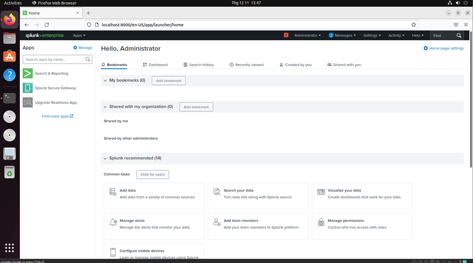
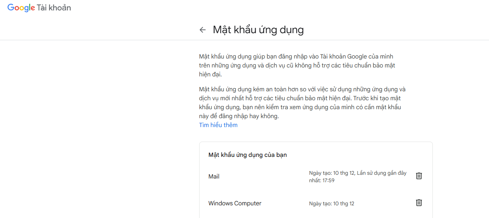
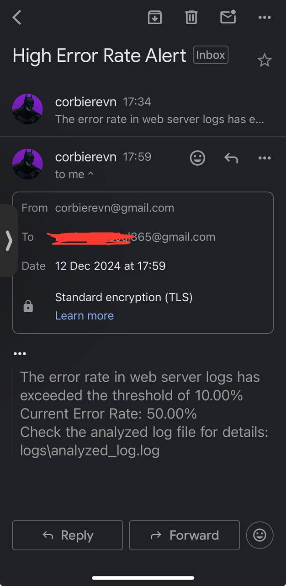

# Lab 1: System Monitoring and Log Analysis Script (Python)

## Objective
This lab involves creating a Python script to monitor system resources, analyze logs, and automate email notifications based on specific conditions. The script covers the following:

- **Monitoring** CPU and memory usage of a system.
- **Logging** the information every minute.
- **Compressing** the log file daily.
- **Parsing and analyzing** web server access logs for insights:
  - Top 5 IP addresses by request count.
  - Most frequently accessed endpoints.
  - Error rates.
- **Automating email notifications** if error rates exceed a threshold.
- Incorporating proper error handling, logging, and parameterization.

> **Note:** This lab demonstrates a basic and intuitive local system monitoring script. For production-ready solutions, consider using tools like **Suricata**, **Splunk**, or **AlienVault** for stable and efficient monitoring.

---

## Prerequisites

### 1. **Environment Preparation**
Ensure your system has the following:

- **Python** (Version >= 3.6)
- Required libraries listed in the `requirements.txt` file.

```bash
pip install -r requirements.txt
```

- A configured **mail server account** (e.g., Google). Generate an app password for Gmail from [Google App Passwords](https://myaccount.google.com/apppasswords).

- An `.env` file to store environment variables securely:

```env
SMTP_SERVER=smtp.gmail.com
SMTP_PORT=587
EMAIL_SENDER=your_email@gmail.com
EMAIL_RECEIVER=receiver_email@gmail.com
EMAIL_PASSWORD=your_app_password
ERROR_THRESHOLD=0.1 # Example threshold: 10%
LOG_DIR=./logs
```

> **Note:** The `.env` file will not be pushed to version control for security reasons.

---

### 2. **Directory Structure**

```plaintext
Lab_Assignment_Final/
├── photos/
├── scripts/
│   ├── logs/
│   │   ├── access.log
│   │   ├── analyzed_log.log
│   │   ├── cpu_mem_usage.log
│   │   ├── daily_logs.gz
│   │   ├── script.log
│   └── helloworld.py
└── terraform/
```

---

## Features

### 1. **Configuration Management**
- Load environment variables from `.env`.
- Define log directories, output files, and error thresholds.

### 2. **Email Notification Function**
Sends email alerts when error rates exceed the threshold.

```python
def send_email_notification(subject, message):
    # Sends an email notification with the given subject and message
```

### 3. **CPU & Memory Monitoring**
Logs CPU and memory usage every minute.

```python
def monitor_cpu_memory():
    # Captures CPU and memory usage metrics and logs them
```

### 4. **Log Compression**
Compresses the log file daily to save space.

```python
def compress_logs():
    # Archives logs older than one day into a .gz file
```

### 5. **Access Log Analysis**
Parses `access.log` for insights such as:
- Top 5 IP addresses by request count.
- Most frequently accessed endpoints.
- Error rate calculation.

```python
def analyze_access_logs():
    # Analyzes access logs and generates insights
```

### 6. **Monitoring Worker**
Runs the monitoring tasks cyclically.

```python
def monitor_worker():
    # Continuously monitors system resources and handles notifications
```

### 7. **Main Script**
Coordinates the execution of all tasks.

```python
if __name__ == "__main__":
    main()
```

---

## Field Test

### 1. **Preparing Access Logs**
Extract data from `access.log` on the web server for local analysis.

### 2. **Running the Script**
Execute the script:

```bash
python helloworld.py
```

### 3. **Expected Behavior**
- **Real-time Monitoring:** Logs CPU and memory usage in `script.log`.
- **Email Notifications:** Sends alerts every 5 minutes if error rates exceed the threshold.
- **Daily Log Compression:** Archives detailed logs into `daily_logs.gz` every 24 hours.

---

## Screenshots

### 1. **Monitoring and Notifications**



### 2. **App Password Configuration**



### 3. **Email Report**



---

## Notes

1. **Error Handling:**
   - Comprehensive error handling ensures the script runs smoothly even in adverse conditions.
   - Logs errors in `script.log` for debugging.

2. **Parameterization:**
   - All configurable parameters (e.g., email, error threshold, log paths) are defined in `.env` for flexibility.

3. **Limitations:**
   - This script is a local monitoring solution and may not scale well for large systems or distributed environments. Consider professional tools for enterprise use.

4. **Security Tips:**
   - Ensure the `.env` file is excluded from version control using `.gitignore`.
   - Do not hardcode sensitive information such as passwords.

---

## Future Improvements

- Add support for distributed monitoring using remote log aggregation tools.
- Implement visualization dashboards for log insights.
- Integrate with cloud platforms for centralized monitoring.

---

## This lab is a complete System Monitoring and Log Analysis Script
